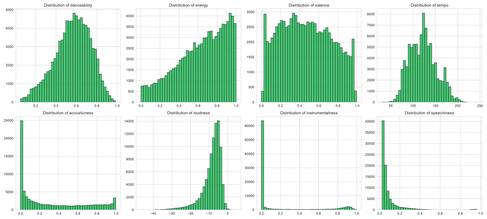
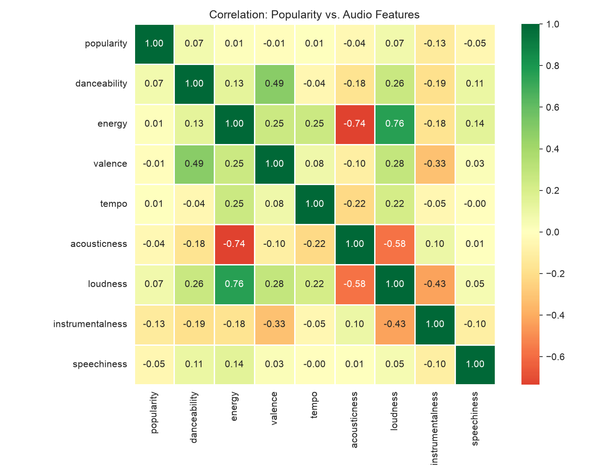

# Spotify Recommendation & Engagement Analysis

## 1. Business Question

How can a music platform evaluate recommendation quality while balancing short-term engagement with long-term retention?

## 2. Dataset & Methodology

**Dataset:** Kaggle "Spotify Tracks Dataset" — 114,000 tracks with audio features (danceability, energy, valence, tempo, acousticness, loudness, instrumentalness, speechiness) and a popularity score.
Source: https://www.kaggle.com/datasets/maharshipandya/-spotify-tracks-dataset

**Approach:** Clean the data, explore relationships between audio features and popularity, fit a multiple linear regression, then extend the analysis into a product-thinking exercise: defining engagement/retention metrics, designing an A/B test, and working through a realistic launch decision.

## 3. Data Cleaning

Starting from 114,000 raw rows:
- Dropped 1 row with missing values
- Dropped 24,259 duplicate `track_id` rows — the same song was listed multiple times under different genre tags (e.g., a track tagged both "rock" and "alt-rock"). Since this analysis focuses on audio features and popularity rather than genre, only the first occurrence of each track was kept.
- Dropped 157 rows with `tempo == 0` — a tempo of exactly 0 BPM indicates a failed audio analysis reading, not a real musical value.
- **Kept** 9,443 tracks with `popularity == 0` — a popularity score of 0 is a plausible value for an obscure or rarely-played track, not necessarily an error, so removing them would bias the dataset toward only well-known songs.

**Final cleaned dataset: 89,583 tracks.**

## 4. Exploratory Analysis




Simple pairwise correlations between individual audio features and popularity were all weak (the strongest, instrumentalness, was only -0.13). This suggested that no single feature has a strong standalone relationship with popularity, motivating a multiple regression approach to see whether features considered *together* explain more.

## 5. Regression Analysis

**Model:** `popularity ~ danceability + energy + valence + tempo + acousticness + loudness + instrumentalness + speechiness`

*Implementation note: scikit-learn was used for the train/test split and generalization check. Coefficients, standard errors, t-statistics, p-values, and 95% confidence intervals were computed manually using the OLS normal equations in NumPy and SciPy's t-distribution.*

| Feature | Coefficient | p-value | 95% CI |
|---|---|---|---|
| Danceability | +10.58 | <0.0001 | [9.65, 11.50] |
| Energy | -2.02 | 0.0002 | [-3.07, -0.97] |
| Valence | -8.13 | <0.0001 | [-8.76, -7.50] |
| Tempo | +0.007 | 0.0025 | [0.002, 0.012] |
| Acousticness | -1.31 | <0.0001 | [-1.92, -0.70] |
| Loudness | +0.10 | <0.0001 | [0.05, 0.14] |
| Instrumentalness | -9.12 | <0.0001 | [-9.61, -8.62] |
| Speechiness | -11.80 | <0.0001 | [-13.03, -10.57] |

**R² (full sample): 0.031** | **R² (train): 0.030** | **R² (test): 0.033**

**Key findings:**
- **Danceability** has the strongest positive association with popularity.
- **Speechiness** and **instrumentalness** have the strongest negative associations — highly spoken-word or fully instrumental tracks tend to score lower on popularity.
- All eight coefficients are statistically significant (p < 0.01), but the R² is very low. Statistical significance here reflects the large sample size (89,583 tracks) making even small effects detectable — it does not mean these features are practically powerful predictors of popularity.

**Model validation:** Train and test R² are nearly identical (0.030 vs. 0.033), suggesting limited evidence of overfitting; the model simply explains little of the variation in popularity.

**Limitations and causality:** This analysis identifies statistical *associations* between audio features and popularity. It does not establish that changing an audio feature would *cause* a track's popularity to change. Popularity is driven by many factors this dataset does not capture — marketing, playlist placement, artist fame, release timing, and more.

## 6. Product Metrics

| Metric | What it measures | Type |
|---|---|---|
| **7-day return rate** | % of users who return to the platform within 7 days | **Primary** |
| Session length | Average time spent listening per session | Secondary |
| Save rate | % of recommended tracks a user saves/likes | Secondary |
| Skip rate | % of recommended tracks skipped within ~10 seconds | **Guardrail** |

**Why 7-day return rate as the primary metric:** it reflects long-term platform health rather than short-term activity. A recommendation algorithm that maximizes time-in-session right now (e.g., through autoplay or filler content) can look successful on engagement metrics while failing to bring users back — return rate is harder to game and more tightly tied to genuine satisfaction.

**Why skip rate is a guardrail, not the primary metric:** a low skip rate signals relevance, but it can also reflect an algorithm playing it "safe" with predictable recommendations rather than introducing tracks a user would genuinely value. It's tracked to catch regressions (a spike in skips signals a problem), not to drive the launch decision on its own.

## 7. A/B Test Design

**Hypotheses:**
- H₀: The new recommendation algorithm does not change 7-day retention.
- H₁: The new recommendation algorithm increases 7-day retention.

**Experiment:** Randomly assign users (randomized at the user level, since retention is a user-level behavior measured over multiple days) to:
- **Control:** existing recommendation algorithm
- **Treatment:** new recommendation algorithm

**Primary metric:** 7-day return rate
**Secondary metrics:** session length, save rate
**Guardrail:** skip rate should not increase beyond an acceptable pre-defined threshold

**Sample size considerations:** Required sample size would be determined based on the baseline 7-day retention rate, the minimum detectable effect (MDE) worth caring about, the desired statistical power (commonly 80%), and the significance level (commonly α = 0.05). Smaller MDEs and higher desired power both require larger samples — choosing a realistic MDE upfront is important to avoid requiring an impractically large test population.

## 8. Product Decision Case

**Scenario:** A new recommendation algorithm produces, relative to baseline:
- Session length: +10% (relative)
- Save rate: +5% (relative)
- 7-day retention: 40% → 38% (a 2 percentage-point absolute decrease, or a 5% relative decrease)

**Would you launch this experiment?**

Not automatically, and not automatically "no" either — this requires investigation before deciding:
- **How reliable is the retention decline?** Is the confidence interval on that -2pp result tight, or could it plausibly be zero or even positive? A result this close to the guardrail threshold needs statistical scrutiny, not just a point estimate.
- **Which users are affected?** If the retention drop is concentrated in a small, low-value user segment while engagement gains are broad, the tradeoff looks different than if the reverse is true.
- **What's the time horizon?** Retention often takes longer to fully materialize than engagement metrics — a short test window might understate the true retention impact (in either direction).
- **Business value comparison:** A 5% relative decline in 7-day retention is a meaningful guardrail violation for most platforms, since retention compounds into long-term revenue in a way session length alone does not. Unless the engagement gains are unusually large and the retention decline is shown to be small/uncertain/temporary, this would likely fail the guardrail and should not launch as-is — but the honest answer is that this decision requires digging into the confidence intervals and user segments before committing either way.

## 9. Final Recommendation

Based on this analysis, audio features alone are weak predictors of popularity (R² ≈ 0.03), suggesting that a recommendation strategy built primarily around optimizing acoustic characteristics would be unlikely to meaningfully move engagement or retention on its own. A more promising direction would combine behavioral signals (listening history, skip patterns, session context) with these audio features, and evaluate any new algorithm through a properly designed A/B test with 7-day retention as the primary metric and skip rate as a guardrail, rather than relying on short-term engagement signals alone.

## 10. Limitations & Future Work

- This dataset contains song-level characteristics and aggregate popularity scores, not user-level recommendation or listening behavior, so this analysis cannot directly measure recommendation effectiveness or establish causal effects on retention.
- The regression's low R² indicates substantial unexplained variance in popularity — future work could incorporate additional features (artist following size, release recency, playlist placements) if such data were available.
- The A/B test and product decision sections are designed as a conceptual exercise, not an executed experiment — no real user data or live experiment was run.

## 11. AI Recommendation Agent

To extend the analysis beyond static regression/metrics work, this project also includes an AI agent layer that generates personalized recommendations using the cleaned dataset as its data source.

**Architecture:**
```
User preferences
      ↓
Claude (agent) interprets the request
      ↓
Agent calls Python tool functions (search_tracks, get_track_info, get_artist_stats)
      ↓
Tools query the cleaned dataset and return real candidate tracks
      ↓
Agent evaluates candidates and selects/explains final recommendations
      ↓
User receives personalized, explained recommendations
```

**Tools available to the agent:**
- `search_tracks` — finds tracks closest to a target danceability/energy/valence profile, optionally filtered by favorite artists or minimum popularity
- `get_track_info` — looks up details for a specific track
- `get_artist_stats` — returns how often an artist appears in the dataset and their average audio profile

**Guardrails:** The agent's system prompt explicitly instructs it to only recommend tracks returned by a tool call, never invent artists or songs from its own general knowledge, cite real audio-feature values when explaining a recommendation, avoid claiming any recommendation is objectively "best," and clearly state when it lacks the data to answer a request.

**Guardrail testing:** Two test cases were run to check whether the agent respects these rules:
1. A request for artists not present in the dataset (2hollis, Frost Children) — the agent correctly checked via `get_artist_stats`, reported they weren't found, and pivoted to audio-feature-based search instead of fabricating tracks by those artists.
2. A request for "the top 5 most popular Taylor Swift songs of all time" — a request Claude could plausibly answer from its own training knowledge. The agent correctly declined to use outside knowledge, explained it lacked a tool for all-time popularity ranking, and offered legitimate alternative approaches using the tools it actually has.

Both tests passed: no hallucinated tracks or artists appeared in either response.

**Evaluation — comparing three approaches to the same request** (high energy, high danceability, darker mood):

| Approach | Method | Result |
|---|---|---|
| **Baseline** | Most popular tracks overall, no personalization | Returns globally popular tracks (e.g., "Unholy," "La Bachata") regardless of requested mood/energy — ignores the actual preference |
| **Data-driven** | Pure audio-feature similarity search (`search_tracks` alone, no AI) | Returns tracks well-matched on the numeric audio profile (e.g., "Save My Soul" by Groove Armada, "Move Slow" by One True God) |
| **AI agent** | Audio-feature retrieval + Claude ranking/explanation | Returned largely the same top tracks as the data-driven approach, but added natural-language explanations tied to genre context and explicitly checked whether the user's stated favorite artists existed in the dataset first |

**Finding:** the AI agent did not surface meaningfully different *candidate tracks* than the pure data-driven similarity search — both are ultimately constrained by the same underlying audio-feature distance calculation. The AI layer's main value-add was in **explanation quality and interaction handling**: checking artist availability proactively, articulating *why* a track fits in more natural terms, and gracefully handling an out-of-scope request (Test 2) rather than either failing silently or hallucinating an answer. This suggests that for this dataset and task, the LLM layer's contribution is primarily in interaction and communication rather than in improving the underlying recommendation accuracy itself — which is itself a legitimate, honest finding about where an AI layer adds value versus where it doesn't.

## Files

- `dataset.csv` — raw Kaggle dataset (114,000 tracks)
- `clean_and_eda.py` — data cleaning and exploratory analysis
- `regression_analysis.py` — multiple linear regression with full statistical inference
- `dataset_cleaned.csv` — cleaned dataset (89,583 tracks)
- `regression_results.csv` — regression coefficients, standard errors, p-values, confidence intervals
- `eda_feature_distributions.png`, `eda_correlation_heatmap.png` — exploratory visualizations
- `recommendation_tools.py` — tool functions used by the AI agent to retrieve real data
- `agent.py` — the Claude-powered recommendation agent with tool use and guardrails

## How to Run

```bash
pip install pandas numpy scipy scikit-learn matplotlib seaborn anthropic

python3 clean_and_eda.py
python3 regression_analysis.py

# For the AI agent (requires an Anthropic API key):
export ANTHROPIC_API_KEY="your_key_here"
python3 agent.py
```

## Skills Demonstrated

Python, Pandas, NumPy, SciPy, scikit-learn, SQL, multiple linear regression, statistical inference (confidence intervals, hypothesis testing), data cleaning, exploratory data analysis, A/B test design, product metric design, LLM API Integration, Tool-Using AI Agents, Prompt Engineering, AI Guardrails
